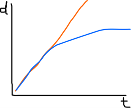

# Nucleotide substitution models

## The problem

As organisms evolve, their DNA accumulates mutations. This may lead us to think that, if we compare the same DNA marker from two organims and count the number of different nucleotides, we can directly infer how much evolutionary distance is between them.

This is false.

Why? Because the number of differences between two nucleotide sequences is not proportional to their time of divergence. One difference between two sequences does not mean that there was only one change.

For example, if we have an `A` in one sequence and a `C` in the other sequence, this can be the result of:

1. The ancestor had `A`, and there was one mutation in the second sequence: 1 observed difference, 1 change.
2. The ancestor had `C`, and there was one mutation in the first sequence: 1 observed difference, 1 change.
3. The ancestor had `A`, and it changed to `G` and then to `C` in the second sequence: 1 observed difference, **2 changes**.
4. The ancestor had `G`, and it changed to `A` in the first sequence and to `C` in the second: 1 observed difference, **2 changes**.
5. The ancestor had `G`, and then it changed to `T` and later to `A` in the first sequence, and to `C`, then to `G`, and then back to `C` in the second sequence: 1 observed difference, **5 changes**.

Additionally, we can have cases in which the same nucleotide in both sequences (**0 observed differences**) come from identical changes from a different ancestral nucleotide (**2 changes**). Or many other different cases...

If we plot the number of observed differences between two sequences (d) against the real evolutionary distance between them (t) we observe this graph: 

In orange, we see the expected line (differences = distance), but in blue we can see the real line. Two extremely distant and unrelated sequences will not usually differ more than a 75%. This has also some logic: if we create two nucleotide sequences by pressing the A, C, G and T keys randomly, 25% of their nucleotides will be identical, just by simple probability.

## Nucleotide substitution models: the basics

In order to deal with this problem, the nucleotide substitution models were created.

The models have a series of parameters:

-	On one hand, we have a **substitution matrix** that define the substitution rates from one nucleotide to another. It has four rows and four columns, representing the four nucleotides in alphabetical order (A, C, G, T). For example, the element in the second row, third column, represents the rate of change from C to G.
-	On the other hand, we have a **frequency matrix** that represents the frequency of each nucleotide in our dataset.

## Jukes and Cantor

The most simple model is the one proposed by Jukes and Cantor in 1969 (**Jukes&Cantor, JC**). It considers that the substitution rates are identical for every nucleotide, as well as their frequencies:

$$
P_{i} = 
\begin{bmatrix}
  . & \alpha & \alpha & \alpha \\
  \alpha & . & \alpha & \alpha \\
  \alpha & \alpha & . & \alpha \\
  \alpha & \alpha & \alpha & . \\
\end{bmatrix}
$$

$$
f = 
\begin{bmatrix}
  \frac{1}{4} & \frac{1}{4} & \frac{1}{4} & \frac{1}{4} \\
\end{bmatrix}
$$

## Kimura with 2 parameters

Later, Kimura proposed an alternative (**Kimura-2-parameter, K80, K2P**) in which the transition rates (substitutions between nucleotides of the same type, A to G, or C to T) are different to the transversion rates (substitutions between nucleotides of different type): 

$$
P_{i} = 
\begin{bmatrix}
  . & \beta & \alpha & \beta \\
  \beta & . & \beta & \alpha \\
  \alpha & \beta & . & \beta \\
  \beta & \alpha & \beta & . \\
\end{bmatrix}
$$

$$
f = 
\begin{bmatrix}
  \frac{1}{4} & \frac{1}{4} & \frac{1}{4} & \frac{1}{4} \\
\end{bmatrix}
$$

## Felsenstein

Felsenstein, on other hand, proposed an alternative (**F81**) in which the nucleotide frequencies change, instead of having different rates for transitions vs transversions. Be aware that changing the nucleotide frequences also affects the substitution matrix!

$$
P_{i} = 
\begin{bmatrix}
  . & \pi_{C}\alpha & \pi_{G}\alpha & \pi_{T}\alpha \\
  \pi_{A}\alpha & . & \pi_{G}\alpha & \pi_{T}\alpha \\
  \pi_{A}\alpha & \pi_{C}\alpha & . & \pi_{T}\alpha \\
  \pi_{A}\alpha & \pi_{C}\alpha & \pi_{G}\alpha & . \\
\end{bmatrix}
$$

$$
f = 
\begin{bmatrix}
  \pi_{A} & \pi_{C} & \pi_{G} & \pi_{T} \\
\end{bmatrix}
$$

## General Time Reversible

Ultimately, models can be as complicated as we want, adding more parameters (for example, as Kimura did) and/or considering different frequencies for the nucleotides (as Felsenstein did).

The most complex of the traditional models is the **Generalised Time-Reversible model (GTR)**, proposed by Tavaré in 1986, in which we have different nucleotide frequences and different substitution rates for each pair of nucleotides:

$$
P_{i} = 
\begin{bmatrix}
  . & \pi_{C}\alpha & \pi_{G}\beta & \pi_{T}\gamma \\
  \pi_{A}\alpha & . & \pi_{G}\delta & \pi_{T}\epsilon \\
  \pi_{A}\beta & \pi_{C}\delta & . & \pi_{T}\theta \\
  \pi_{A}\gamma & \pi_{C}\epsilon & \pi_{G}\theta & . \\
\end{bmatrix}
$$

$$
f = 
\begin{bmatrix}
  \pi_{A} & \pi_{C} & \pi_{G} & \pi_{T} \\
\end{bmatrix}
$$

## Table of nucleotide substitution models

The following table resume all the possible combinations of the traditional models with their abbreviations:

| Number of substitution rates | Same nucleotide frequencies | Different nucleotide frequences |
| ------ | ------ | ------ |
| 1 | Jukes and Cantor (JC) | Felsenstein 81 (F81) |
| 2 | Kimura-2-parameter (K2P, K80) | Hasegawa, Kishino and Yano (HKY85) |
| 3 | Kimura-2-parameter (K3ST, K81) | Tamura-Nei (TrN) |
| 4 | Transition model, equal frequences (TIMef) | Transition model (TIM) |
| 5 | Transversion model, equal frequences (TVMef) | Transversion model (TVM) |
| 6 | Symmetrical (SYM) | General Time Reversible (GTR, REV) |

## Spicing up the model

Models can include additional parameters to describe the rates of change from one nucleotide to another.

The parameter called **invariants** (I) adds information about if some nucleotides in our matrix are always invariable, i.e. they never change.

The parameter called **gamma** (G o Г) adds information about the shape of the distribution that determines how the variable nucleotides change. This shape is always a gamma probabilistic distribution, which is defined by a parameter (α in phylogenies) which determines its general shape and steepness. For example, with α=1 we have many invariable positions and a few positions that change frequently; with α=2 there is a lot of heterogeneity, with α=9 most positions change frequently...
