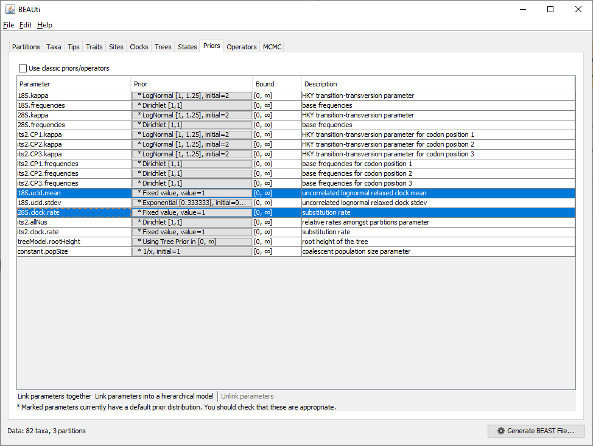
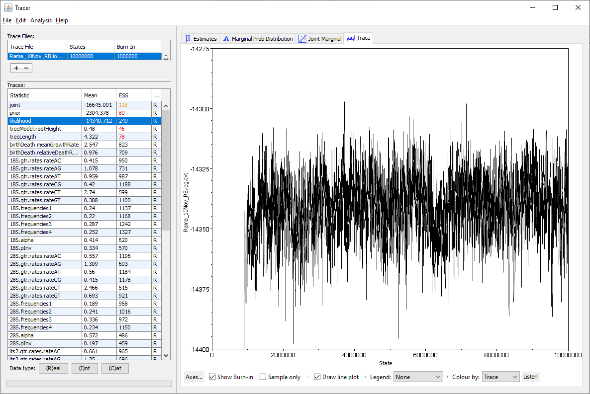

# Tutorial: Dating with BEAST

At first sight, **BEAST** is a very complex program. While it can make people afraid, it gives a high versability in our analyses.

Actually, BEAST is a very simple program that simply takes an XML file, which contains all the information about our data and the models, and explores the tree space in the same way as MrBayes does. The XML file is created in another program called **BEAUti**, which is distributed along with BEAST.

One of the main differences between MrBayes and BEAST is how they explore the tree space. MrBayes mainly plays changing the length of the branches, while BEAST prefers to modify the topology of the tree.

BEAST is specialized in producing trees in which the heights of the nodes are **proportional to the time** since the divergence events that they represent. For this same reason, the trees will be **ultrametric**, in which all the tip nodes (our taxa) have the same height, representing that they were sampled at the same time (unless we configured the analysis in a different way, see below).

## Downloading BEAST (and BEAUti)

The package that includes BEAST and all the associated software can be downloaded from [its website](https://beast.community/). You will get a zip file. Unzip it, and you will find there BEAST, BEAUti and other programs.

You will need to have a **Java** environment, such as OpenJDK, installed on your computer.

The new versions of BEAST also require the **BEAGLE** library, which can be installed following [these instructions](https://beast.community/beagle).

## Preparing the data: BEAUti

In order to prepare the data for BEAST, we must use BEAUti.

This program, with a very hostile interface for beginners, is a very versatile program that will let us, through a series of tabs, to tune up all the parameters for all the models that we will include in our analysis.

At the end, it will create the XML file that will be read by BEAST, including all the instructions for the analysis.

### Importing data

In order to load our data matrix (in NEXUS format) we have to click on `File` > `Import Data...`. We navigate to the folder where we have our matrix, in NEXUS format, and select it.

If our data is partitioned (includes different markers), we can import it following two different ways:

1. From a single NEXUS file, where we included an `assumptions` block (check the [NEXUS file format section](https://github.com/atanvardo/Phylo-Tutorial/blob/main/02-Data%20files.md#nexus-format) on the lesson about data files).
2. From a different NEXUS file for each partition, importing them sequentially. Be aware that the taxa names must be the same in each matrix.

It will show the composition of our matrix in the `Partitions` tab.

In this table we have a row for each partition (if our data is unpartitioned, it will show only one).

If we have a look at the right side of the table, we can see that, by default, all of the partitions share the same nucleotide substitution model (site model), the same clock (clock model) and the same tree. It is advisable to tell BEAST to use different nucleotide substitution models and clocks for each partition. In order to do this, we select all the partitions (`Ctrl` + `A`), and then we click on the `Unlink Subst. Models` and `Unlink Clock Models` in the toolbar just above the table. If everything is correct, we will see now a different name for the site models and clock models in each row.

### The next tabs

For normal analyses, we skip the next three tabs, but I will explain briefly what they are used for:

- In the `Taxa` tab we can define groups of taxa. This is useful when we want to force that a particular group will be monophyletic, or when we date with events (see the extra tutorial at the end).
- In the `Tips` tab we can choose if some of our taxa (terminal nodes) have a different age than the rest. This is useful for phylogenetic studies of virus or fast-evolving bacteria, which are useful in epidemiology, or if we include fossils in a matrix based on morphological data.
- In the `Traits` tab we can add manually morphological data or similar characteristics.

Other tabs that we do not usually check are:

- The `States` tab, which will allow us to reconstruct the ancestral states for each nucleotide along the tree.
- The `Operators` tab, in which we select the parameters calculated in the analysis and the relative weight (importance) for each of them. Do not touch this unless you really know what you are doing!

### Nucleotide substitution models

In the `Sites` tab we define the nucleotide substitution models for our different partitions. We should have calculated the most appropiate model for each of them in jModelTest or a similar program beforehand.

As usual, be aware of the different terminology that each program uses for the models, and check the [table](https://github.com/atanvardo/Phylo-Tutorial/blob/main/04-Nucleotide%20substitution%20models.md#table-of-nucleotide-substitution-models). For example, all the models in BEAST will include different nucleotide frequencies by default (it is shown as the `Estimated` option on the `Base frequencies` menu), so if we choose the Jukes and Cantor model (**JC**) we will be actually choosing the Felsenstein 81 model (**F81**)!

In the `Site heterogeneity Model` menu we can choose to include the proportion of invariant sites and/or the gamma distribution to our model.

If any of our markers is coding, it is advisable to choose the option for partitioning it into codon positions. We can choose to have the same parameters for the first and second position, or different parameters for each of them.

Tip: if we have a lot of partitions and the same model applies to all, or most, of them, we can set the model for one of them and then use the option `Clone Settings...` at the bottom.

### Setting the molecular clock

And now we arrive to the interesting part.

If you just want to run a basic phylogenetic analysis, without clock, skip this section. BEAST will work perfectly without setting a clock, and it will create a tree which represents the relationships between our taxa, and in which the branch lenghts are proportional to time, but relatively (we will not know how many years correspond to each unit of length).

If you want to use a clock, continue reading.

This tutorial will assume that we are going to use a **molecular clock**, i.e. we know the mutation rate of our markers in our taxa (because someone alredy published it). If you want to calibrate with fossils or biogrographic events, look at the extra tutorial at the end.

In the `Clocks` tab, we select which kind of clock we want to use for each partition. There are different options, but the basic ones are the first two, corresponding to a **strict clock** and to a **relaxed clock**. A strict clock will assume that the substitution rate is the same in all the branches and along all the tree. It is simpler and requires less time and computing power, but also unrealistic. A relaxed clock let the rate vary in different lineages and times. It is more complex, includes more parameters to calculate, but represents better the evolutionary history of real organisms.

In order to set the rates, we must go afterwards to the `Priors` tab. In this tab, we see all the parameters that will be calculated during the analysis, and the *a priori* distribution for each of them. This means that BEAST does not start to try to assign totally random values to each parameters, but that each of them has a statistical distribution associated from which BEAST will be taking their values.

The clock rate for each partition is defined by the priors named `[partition name].clock.rate` if we choose a strict clock, and `[partition name].ucdl.mean` if we choose a relaxed clock.

When we click on the prior value (second column), a small window will appear showing which is the distribution of values for that parameter. By default, it will be a fixed value of 1. This means that BEAST will consider that each fragment mutates a rate of 1 mutation per site per million years, without any variation. This is obviously unrealistic, so mwe must change that.

The distribution and values will depend on the data that we have about the molecular clock of our markers on that group of organisms:

- We may know the upper and lower values of our molecular clock. In that case a uniform distribution, in which we set these boundaries and let BEAST choose values randomly between them, can be appropiate.
- If we know the mean and the standard deviation, we can choose a normal distribution. BEAST will choose with greater probability values closer to that mean, but allowing certain level of variation. For these distributions, BEAUti will show a graph that will let us check visually if these values actually represent what we want to tell BEAST.

How will we know if we set these values properly? Patience, we will have to run the analysis and check it afterwards.

### Tree model

In the Trees tab we select the model that determines the distribution of the branching patterns in our tree, i.e., how BEAST will assume that our taxa diverged.

There are two types of tree models:

- **Coalescent** models assume that the branching events in the tree correspond to divergences of lineages within a species. They are useful for phylogenies that include one species, a group of closely related species, or even a genus.
- **Speciation** models assume that the branching events correspond to divergences between species. They are a better representation of older events and are useful for phylogenies at a genus level or higher.

### Last steps in BEAUti

Finally, we go to the `MCMC` tab. Here we must select some important parameters:

- `Length of chain`: This is the number of steps/generations that our analysis is going to run. By default, is 10 million, which should be enough for a standard analysis. For larger datasets, it will be necessary to add more generations. Our aim is that the probability graph should reach the stationary phase (see the [MrBayes tutorial](https://github.com/atanvardo/Phylo-Tutorial/blob/main/T04-MrBayes.md)). But, if our analysis does not reach the stationary phase after 100 million generations, it is highly improbable that it will ever reach it, and we should reconsider the dataset and the models.
- `Log parameters every`: This value sets every how many generations BEAST is going to save the values of each of the parameters. Ideally, we should have 10000 samples at the end, so this value should correspond to the length of chain divided by 10000.
- `File stem name`: The name of the output files. Please choose a meaningful name that will make you easier to remember what you included in the analysis.

Once everything is set, we can click on `Generate BEAST File`. BEAUti will ask once again to check the values of the priors, and after that we can finally save the file, creating a XML file.

### But, wait, which models should I choose?

Ok, so you did not know if you have to use a strick or relaxed clock, or if you have to use a coalescent or speciation tree model?

Don't worry. Try all the combinations! We will see afterwards how to choose the best.

## Running the analysis: BEAST

Once the XML is saved, we can close BEAUti and open BEAST.

BEAST is so simple that barely needs any explanation. It will pop a window where we select our XML file on the top part, and then click on `Run` at the bottom.

And wait.

Once the analysis is finished, BEAST will have generated several files in the same folder as our XML file. The most important are the ones with extensions `.log.txt`, which includes the values of the parameters in each sampled generation, and the `.trees.txt` file, which included all the sampled trees.

At this moment, we still do not have our definitive tree. We will have to wait a bit more for it.

Now, it is time to use our friend TRACER.

## After the analysis: TRACER

TRACER is an independent program that allow us to check the output of the BEAST analyses and see if there was any problem with the run or calculating any parameter.

It is distributed independently from BEAST. It has to be downloaded and unzipped from [its own website](https://beast.community/tracer).

### Checking the analysis

When we open TRACER, it will show a window divided in several panels. Under the first panel, on the top left, we can see a `+` sign. If we click on it, we can load the log file (with extension `.log.txt`) generated by BEAST. Then it will show a summary of the values for each parameter.

In the table of the parameter values, it will show the mean value of each parameter during the analysis, and a column with the effective sample size (ESS). This value is very important. We must check the color of the number shown in this field:

- **Black**: This means that the parameter was estimated correctly.
- **Yellow**: This means that there might be some inaccuracy in the calculation of the values for that parameter, but you should not worry.
- **Red**: This means that the values calculated for the parameter do not correspond to reality and we should check what happened. It we look at the graph on the right panel, which shows the distribution of the values that BEAST used for this parameter throughout the analysis, we can see what is the problem. Sometimes, the distribution of the parameter values is 'pushed' towards one of the sides of the graph, which means that the real value may be outside the limits that we set for this prior in BEAUti. Alternatively, we may see that there are double peaks, which are more worrisome and difficult to address. Or any other kind of artifact. We must closely examine each casi in particular and think about what may be causing problems with that parameter.

Anyway, if there are only a few parameters in orange/red values, it should not be a major problem.

The most important parameter in which we should focus is the one called **Likelihood**. As long as this parameter is black, no problem. But you must check the `Trace` tab on the right, having this parameter selected. This is equivalent to the graph shown by MrBayes with the `sump` command, and will show if our analysis has reached the statuionary phase.

If the Likelihood ESS is in orange or red, we may try to change to increase the burn in value and check if it improves. By default is 10% of the generations, but you can try to increase to 20-25% and see if it improves. In that case, remember the burn in value for later.

### Comparing models: Bayes factors

**Warning**: This function was removed in the last versions of TRACER, maybe because it actually is a somewhat controversial analysis. In order to use it, you must try to find the 1.6 version.

As stated before, we usually don't know which clock or tree model is the best. In order to solve this issue, we can run alternative analyses with all the possible combinations. Then, in TRACER, we can load together the log files from all these analyses.

In order to compare the models, we select all the analyses on the top left panel (selecting one and pressing `Ctrl` + `A` will do the trick), and then click on `Analysis` > `Model comparison...`

In the small window that pops up, we must select `likelihood` in the first option, and `harmonic mean` in the second. Then we click on `OK` and wait.

TRACER will then create a table in which it faces each analysis with all the others. The values will indicate how much better is the model (or combination of models) corresponding to the row compared to the model corresponding to the column. Positive numbers indicate that it is better, negative numbers indicate that it is worse. So, the best model, or combination of models, will be that for which **all** the values are positive numbers.

## Getting the tree: TreeAnnotator

Ok. Now we have checked that the analysis ran well, that the parameters are correctly calculated, how much burn in we should remove, and which of our alternative model combinations worked better. It is time to get the tree.

We open the program TreeAnnotator, which should be in the same folder as BEAUti and BEAST. This program is very simple.

On the top section, we must select how much burn in we are going to remove. We have two options, by number of states (generations) or by number of trees. For example, if we ran the analysis for 1 million generations, sampling a tree every 100 generations, we will have 10000 trees stored[^1]. If we remove the first 20% as burn in, we must select either 200000 states or 2000 trees. Both are equivalent.

On the bottom, we select as input file the `.trees.txt` file generated by BEAST, and as output we create a new file (remember to choose meaningful names). Then we click on `Run` and TreeAnnotator will do its magic.

At the end we will have a file that contains our tree in NEXUS format, and can be examined in any tree viewer.

## Extra tutorial: dating with fossils

1. In the `Taxa` tab, create a group including all the taxa that are part of the same taxonomic group as the fossil.
2. In the priors tab, select the prior called `tmrca([name of the group])`.
3. Choose a lognormal distribution.
4. Set the offset to the age of your fossil. Check that the graph correctly represents that the age of the taxonomic group should be ***older*** than the fossil.
5. Adjust the mu and sigma parameters until the graph represent a reasonable distribution of possible ages.

[^1]: Actually 10001, counting the starting tree, but that doesn't matter.
