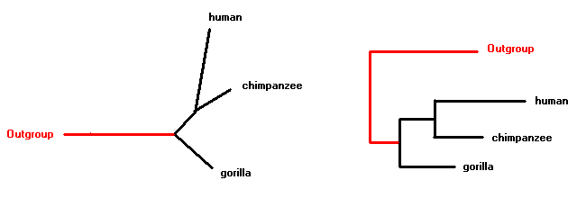

# Trees

The basic element of phylogenetics is the **tree**, a graphical representation of the relationships between different organisms or taxa. It is composed by a series of **nodes** connected by **branches**.

The nodes can be **terminal** (corresponding to the taxa that we are studying) or **internal**. There are **three** branches splitting from each node, each of them can lead to a terminal node or an internal node.

## Rooting

Trees can be **rooted** or **unrooted**. An unrooted tree just shows the relationships between the taxa and the distance between them, but it can’t determine which ones are in more **basal** or derived positions.

In this picture, the tree on the left is unrooted. The tree on the right is rooted. They are the same tree, but on the right side the tree is oriented in a way that we can determine in which direction the clades originate. For example, we can see that humans and chimpanzees are closely related, and that gorillas diverged earlier in the evolution of this group. We are unable to see this pattern in the unrooted tree.

**Be aware that the real "shape" of a tree is the unrooted version!** Rooting a tree is usually an artificial modification that we do in order to make a better interpretation. Some phylogenetic programs produce unrooted trees as output, and when we open them in a tree viewer software we may think that they are rooted. Be careful with this!

In order to root a tree, we can use different methods:

- **Mid-point rooting**: It takes the two most distant taxa, and places the root in the mid-point between them. This premise is very weak, so using this method is not advisable.
- **Outgroup**: This method is based on including at least one taxon that is external to our study group, and places the root between this taxon and our ingroup. It is recommended to include at least three outgroups that have a paraphyletic relationship with our ingroup.

## Types of trees

According to their characteristics, we can have different types of phylogenetic trees:

-	**Dendrogram**: This term denotes any tree, in general. It refers to the mathematical construct that represents the relationship between diverse elements.
-	**Cladogram**: It is a tree that only shows the relationships between the organisms, or their ramification pattern. It is obtained using cladistic methods, such as Maximum Parsimony.
-	**Phylogram**: Tree that shows information about the number of nucleotide substitutions (genetic distance) that separates each lineage, usually codified as the length of the branches.
-	**Chronogram**: Tree in which the length of the branches is proportional to the time elapsed between two divergence events.
-	**Ultrametric tree**: Tree in which the terminal nodes are vertically aligned. Chronograms are usually ultrametric (all the terminal nodes correspond to organisms living in the current time), except those dealing with virus or bacterial samples taken along a temporal series.

## Clades, monophyly, etc

We can find different kinds of clades, or groups of organisms:

- **Monophyletic**: These clades include all the organisms that descend from a common ancestor. It is the only type of clade that is considered valid. For example: mammals, angiosperms…
- **Paraphyletic**: It includes organisms that descend from a common ancestor, but not all of them. Technically it is incorrect to consider them as valid groups, but some paraphyletic groups are recognized by tradition (for example, reptiles).
- **Polyphyletic**: These clades include differnt orgasnims that are not related between them. For example: flying vertebrates.

Two clades are sister clades if the descent from a common ancestor, forming a monophyletic clade together. We can distinguish them on trees as the two descendants from an internal node. For example: humans and chimpanzees, in the tree above.

Usually, nodes bifurcate in two clades (**dichotomy**)[^1]. Sometimes, we can find three (**tritomy**) or more (**polytomy**) clades originating from a single node. This is an artefact that generates when the algorithm used to reconstruct the tree could not decide which is the relationship between these clades. Maybe our sequences are too few, or their quality is not optimal, or they are identical. They can also be generated when we generate consensus trees. Polytomies are normal and can be published, unless they are very exaggerated[^2].

[^1]: Warning! Each internal node has THREE branches: two connecting to their “children” clades, and one that connects it to the rest of the tree. Never forget this last branch, which is usually overseen if we are working with rooted trees.

[^2]: Never show in front of an audience a polytomy composed of many clades (haircomb tree or fishbone tree)
