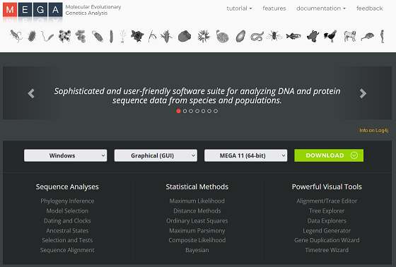
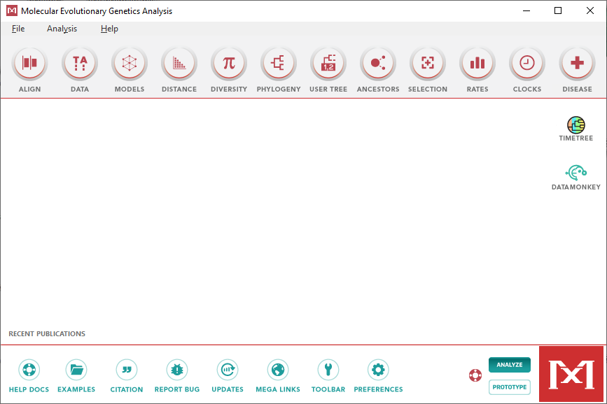
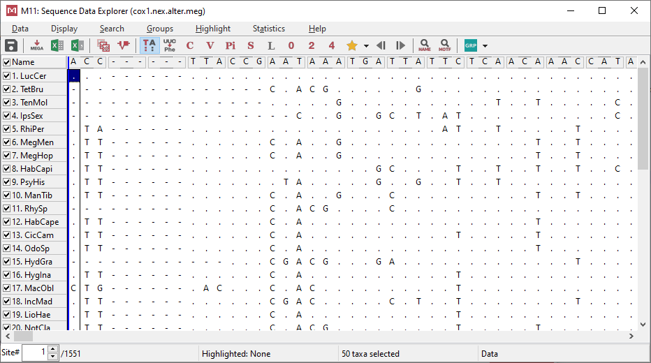
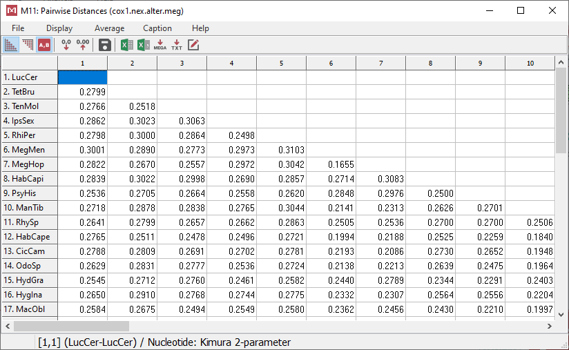

# Tutorial 1: MEGA. Genetic distances and Neighbor-Joining

The MEGA software has a set of tools that allow us to carry out phylogenetic analyses and calculate some parameters from our sequences.

It has a relatively friendly interface, although it may be a bit confusing when importing data from other sources. Additionally, it has its own data format, which we described above.

## Downloading and installing MEGA

In order to download MEGA, we should go to their website: [www.megasofware.net](https://www.megasofware.net)

There, we select the appropiate version. It will ask us to accept the license agreement, and afterwards we will have to fill some personal data. After filling all this information, the installer will be downloader. We can install MEGA just executing that file.

During the installation, it will show that by default MEGA sets itself as the defaul program for opening phylogenetic files. My personal preference is to uncheck that box, as I prefer to open them using a simple text editor (such as Notepad++).

When the installation is finished, we can open MEGA from the Start menu or wherever you chose to create the shortcut.

## Creating a MEGA file. Introduction to ALTER

For some reason, MEGA requires the data in its own particular format, also called MEGA. So, the first step consists of converting our matrix (we are going to assume that we have it in NEXUS format) to the MEGA format.

MEGA includes a tool to do this transformation. But, based on my experience, for some strange reason this tool tends to produce files with some mistakes that make them unusable by the program.

Fortunately, we have ALTER. This service (available [here](https://sing.ei.uvigo.es/ALTER/) ), allow us to transform matrices from any format to another, usually without any problem.

In order to use it, we should follow these steps:

1. In the first panel (**1.- select format**), we check the box called **Autodetect**.
2. In the second panel (**2.- upload or paste MSA**), we select the operative system ***in which our input file was created***, and click on **Upload**. We look for the data file in our computer and select it.
3. In case that there is any kind of problem with our data file, it will be indicated in the panel below. It usually indicates exactly where the problem is in our data file (line and position), so we can open the file in a text editor to correct it.
4. If everything is OK, the third panel (**3.- select output format and convert!**) with be activated. There we will select the program where we want to import our file (in our case, MEGA) and the format (same). Then we click on the **Convert** button and ALTER will do its magic.
5. It is advisable to check the **advanced options**. If we are creating a NEXUS format, we should select the **sequential** option, as some programs will have problems reading non-sequential matrices. There is also an option to **collapse** the sequences into haplotypes, which can be useful for very complex analyses and it is essential for species delimitation from a BEAST tree.
6. In the last panel (**4.- save converted MSA**), we select the operative system in which we want to run the analysis and click on **Save** to create the file.

## Importing data to MEGA

In order to load our file in MEGA, we have to select `File` > `Open a File/Session`. We find our file, and open it.

MEGA will show a box asking which kind of data are stored in our file. Most probably they are nucleotides, so if this is the case we select that option.

Afterward, it asks if our sequences codify for genes. We will have to press `Yes` or `No` depending on the fragment we are analyzing. In case of doubt, or if our sequences are only partially coding, we should mark `No`.

If we tell MEGA that our sequences are coding, it will asks which genetic code it should apply. Our selection depends again on which data we are analyzing. In we work with animals, we usually have to select **Standard** for nuclear genes, and **Invertebrate mitochondrial** or **Vertebrate mitochondrial** for mitochondrial markers. But be careful, as some groups of animals have different genetic codes; please check the list to find for alternative genetic codes that may apply to your taxonomic group.

## Visualizing the matrix

In the main screen of MEGA, we can see now an icon with the letters `TA`. If we click on it, we will open the matrix explorer.

The most interesting tool of this window is the ability to check several properties of our sequences, using the buttons in the tool bar above.

- The button with the letters `TA` hides the nucleotides that are identical to those in the first sequence, to have a visual idea of the variability of our sequences.
- The button `UUC-->Phe` translates our sequences from nucleotides to aminoacids or vice versa (only if our fragment is coding!).
- The button `C` highlights the conserved positions, i.e. those that are identical in all the sequences, showing the total number in the bar below. The button `V` is the opposite, highlighting the variable positions.
- The button `Pi` highlights the informative sites, i.e. those in which we can find at least two different states, each of them present in at least two sequences. Phylogenetic analyses rely on these positions to create the trees.
- The buttons `0`, `2` and `4` highlight, respectively, the 0-fold degenerate sites (positions in which the changes are non-synonymous), 2-fold degenerate sites (positions in which one of the three changes is non-synonymous), and 4-fold degenerate sites (positions in which all the changes are synonymous).

## Calculating genetic distances

MEGA allow us to calculate the genetic distances between our sequences. In order to do this, we have to click on the icon called `Distance` in the toolbar of the main screen, and then click on `Compute Pairwise Distances`.

It will open a window in which we can select the parameters for the calculation of distances. The most important one is the **nucleotide substitution model**. MEGA has a peculiar selection of models: a couple of basic models, a couple of medium level models, and some exotic ones. Usually, for a simple distance calculations, the K2P model (Kimura 2-parameter) is enough.

Once we have chosen the appropriate parameters, we click on `Compute` to run the analysis.

MEGA will generate a table in which it represents the genetic distance (corrected according to the nucleotide substitution model that we chose) between each pair of sequences. Using the toolbar above, we can select how many decimals we want, and export the table to various formats (from basic text files to Excel spreadsheets).

## Phylogenetic analysis: Neighbor-Joining

We can also use MEGA to run phylogenetic analyses. Although it is able to run different algorithms, experience tell us that it is not advisable to use it for anything more complex than Neighbor-Joining, as it usually produce weird topologies.

In order to run this analysis, we have to click on the `Phylogeny` on the toolbar in the main screen, and choose the option `Construct/Test Neighbor-Joining Tree`. Then MEGA will show a window to select the parameters.

We should always include the **bootstrap** method to test the reliablity of the nodes of our tree. This is essential for this kind on analysis. It is selected on the `Test of phylogeny` option. We should select at least 1000 replicates, but it is advisable to do at least 10000.

In the case of the nucleotide substitution model, we should select some model that is a bit more advanced that the K2P that we used for calculating the genetic distances. Please check the model selection tutorial to know which is the most appropiate for your data.

When we have checked everything, we click on `Compute` and wait while the analysis runs. It should not take very long.

At the end, it will show a window with two tabs: `Original Tree` and `Bootstrap consensus tree`. The first tab show the tree obtained from the analysis of our sequences, including the support of each node. The second tab corresponds to a consensus tree obtained from the bootstrap replicates. We are interested on the first tree, the one called "Original".

In the `File` menu there is an option to save our tree in Newick format, and in `Image` we have several options to export it as different types of images.

## A note about trees and image files

Something very important to consider when saving our tree is which image we should use. There are two kinds of files:

- **Raw tree** files (Newick, NEXUS...): These files store the topology of the tree and all the information attached in a raw format (check the [lesson](https://github.com/atanvardo/Phylo-Tutorial/blob/main/02-Data%20files.md#newick-format) about data files). They can be opened in a file explores program (FigTree, TreeView, Dendroscope...), where we can modify the general appearance before exporting them as images.
- Image files:
	- **Raster** (jpg, tiff, png, bmp...): These images are formed by pixels, which can be seen if we zoom in. It is not advisable to store phylogenetic trees in these formats, as it makes very difficult or impossible to edit the file. Additionally, their resolution is limited.
	- **Vector** (svg, emf…): The image is stored as a series of lines and shapes. Their resolution is infinite. The trees stored in these files can be edited in programs like Inkscape, CorelDraw or Adobe Illustrator to improve how it looks, highlight some branches or nodes, or add more information. Be aware that, when editing a tree in a graphic software, you should NEVER change the relative lenghts of the branches. When we are done editing the image, we can save it as a raster file (preferably png) that we can include in our manuscript.
